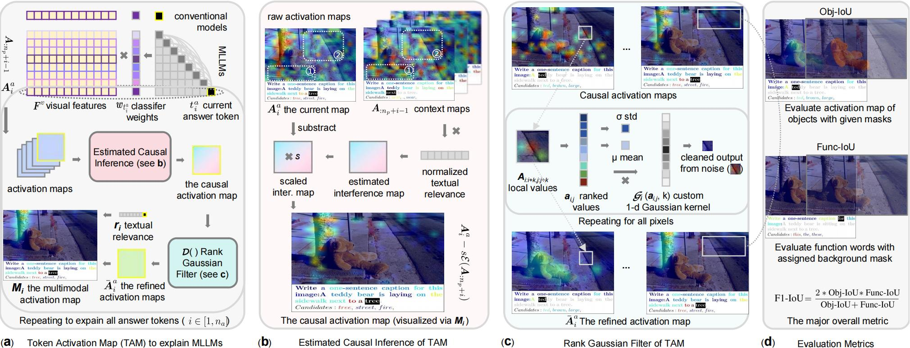

# Token Activation Map to Visually Explain Multimodal LLMs

[ICCV 2025 Oral] We introduce the Token Activation Map (TAM), a groundbreaking method that cuts through the contextual noise in Multimodal LLMs. This technique produces exceptionally clear and reliable visualizations, revealing the precise visual evidence behind every word the model generates.

[](https://arxiv.org/abs/2506.23270)


(a) The overall framework of TAM. (b) Details of the estimated casual inference module. (c) Details of the rank Gaussian filter module. (d) Fine-grained evaluation metrics.

## Installation

### Quick Setup (Choose One)

#### Option 1: Automated Setup (Recommended)
```bash
git clone https://github.com/adityanagachandra/TAM.git
cd TAM
./setup_conda_env.sh
```

#### Option 2: Manual Setup
```bash
git clone https://github.com/adityanagachandra/TAM.git
cd TAM
conda create -n TAM python=3.9 -y
conda activate TAM
pip install -r requirements.txt
```

### Detailed Installation

For complete installation instructions, troubleshooting, and platform-specific guides, see **[INSTALL.md](INSTALL.md)**.

### Quick Verification

```bash
conda activate TAM
python -c "import torch, cv2, transformers, fitz; print('✅ Installation successful!')"
python demo.py  # Run demo (downloads ~4GB model on first run)
```

### Requirements Summary

All dependencies are in [requirements.txt](requirements.txt):
- **Core**: `transformers==4.52.1`, `torch`, `accelerate`
- **Vision**: `opencv-python`, `pillow` 
- **Processing**: `pymupdf` (provides `fitz`), `numpy`, `scipy`
- **Utils**: `matplotlib`, `nltk`, `rouge`, `tqdm`

**⚠️ Important**: Do NOT install the standalone `fitz` package - PyMuPDF provides the correct one.

## Usage

### Demo
Run a demo for qualitative results:
```bash
python demo.py
```
The demo supports both image and video inputs. Update the inputs in the script accordingly for other scenarios.

### Evaluation
1. **Download Datasets**
   Download the formatted datasets for evaluation:
   - [[COCO14+GranDf+OpenPSG](https://hkustconnect-my.sharepoint.com/:u:/g/personal/ylini_connect_ust_hk/EXL-stkCxk5DnwRkNw9MgSABu1vFPv_0FI60yxl0OYxSGQ?e=V3qjHh)]
   - [Hugging Face Dataset](https://huggingface.co/datasets/yili7eli/TAM/tree/main)

2. **Run Evaluation**
   ```bash
   # python eval.py [model_name] [dataset_path] [vis_path (optional)]
   python eval.py Qwen/Qwen2-VL-2B-Instruct data/coco2014
   ```
   
   **Note**: Results may vary slightly depending on CUDA version, device, and package versions.

## Custom Model Integration

### Step 1: Load Custom Model
Load your multimodal model using standard transformers methods.

### Step 2: Get Logits with Hidden States
```python
outputs = model.generate(
    **inputs,
    max_new_tokens=256,
    use_cache=True,
    output_hidden_states=True,  # TAM requires hidden states
    return_dict_in_generate=True
)
logits = [model.lm_head(feats[-1]) for feats in outputs.hidden_states]
```

### Step 3: Prepare Input Arguments
```python
# Define special token IDs for token separation
# Format: [start_token(s), end_token(s)]
# Selected tokens are [start + 1: end]
special_ids = {
    'img_id': [XXX, XXX], 
    'prompt_id': [XXX, XXX], 
    'answer_id': [XXX, XXX]
}

# Define output vision map shape (height, width)
vision_shape = (XXX, XXX)
```

### Step 4: Generate Token Activation Maps
```python
raw_map_records = []
for i in range(len(logits)):
    img_map = TAM(
        generated_ids[0].cpu().tolist(),
        vision_shape,
        logits,
        special_ids,
        vis_inputs,
        processor,
        os.path.join(save_dir, str(i) + '.jpg'),
        i,
        raw_map_records,
        False  # Set to True for eval only
    )
```

For detailed implementation, see comments in `tam.py`.

## Troubleshooting

### Common Issues

1. **ModuleNotFoundError: No module named 'cv2'**
   ```bash
   pip install opencv-python
   ```

2. **Accelerate package missing**
   ```bash
   pip install accelerate
   ```

3. **Fitz module conflicts**
   ```bash
   pip uninstall fitz -y
   # PyMuPDF provides the needed fitz module
   ```

4. **CUDA out of memory**
   - Reduce batch size or use a smaller model
   - Ensure GPU has sufficient memory (recommended: 8GB+ VRAM)

5. **Model download interrupted**
   - Ensure stable internet connection
   - The model download will resume automatically on restart

## System Requirements

- **RAM**: 16GB+ recommended
- **GPU**: 8GB+ VRAM recommended for smooth operation
- **Storage**: 10GB+ free space (for models and data)
- **OS**: Linux, macOS, or Windows with WSL2

## LICENSE
This project is licensed under the MIT License.

## Citation
```bibtex
@misc{li2025tokenactivationmapvisually,
      title={Token Activation Map to Visually Explain Multimodal LLMs}, 
      author={Yi Li and Hualiang Wang and Xinpeng Ding and Haonan Wang and Xiaomeng Li},
      year={2025},
      eprint={2506.23270},
      archivePrefix={arXiv},
      primaryClass={cs.CV},
      url={https://arxiv.org/abs/2506.23270}, 
}
```

## Acknowledgments

This is a fork with enhanced installation documentation and dependency management. Original implementation by Yi Li et al.